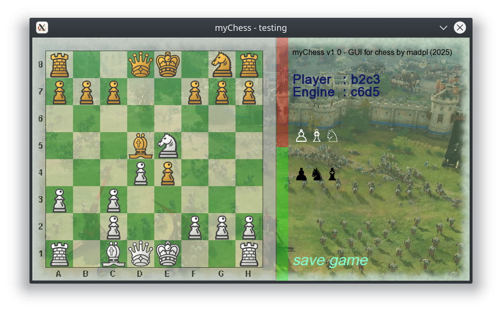

# My Chess GUI (SFML) for Stockfish
This is an example of a program that uses the stockfish engine and you can play chess with this engine.

It's still an early version - it has bugs. But you can already play a game:))

If you can may cloning this project and you can cooperate:))

The main branch already has a working save load game option. Finally, we managed to make the necessary 

corrections on the working branch.

If you want to save the game state, press the 's' key, and if you want to load a previously saved game,

press the 'l' key.   

***The program is still developing.*** 

main is always the branch to compile, working is the branch where we make changes most often.

Build: 
git clone .... myChess (or any other location) 
if not exists build directory, please create it: 
mkdir build 
cmake -S .   -B ./build 
cmake --build ./build  

This is what the GUI we create looks like

Many corrections have been added, such as: castling bug has been fixed. During the game, a bug was revealed,

consisting of the spontaneous movement of the h8 rook to f8, if the engine moved the rook from e8 to g8.

A score bar has also been added, which shows the strength of the position of each side. For now, it is just

a mock-up, but we are working hard on this score bar. There is still a lot to do: during the promotion of 

a pawn to a queen, the engine goes crazy and starts making moves on the wrong side - this is another big 

bug to fix, which was revealed during the game. Work in progress. 

*Best regards - team of myChess*.
